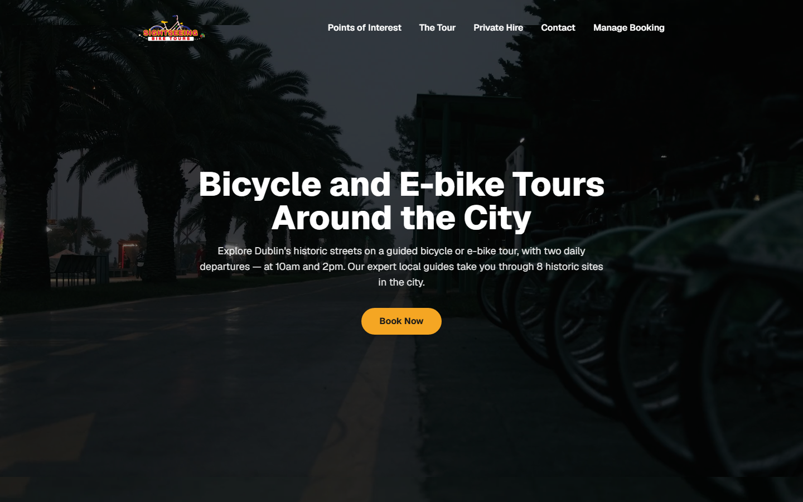
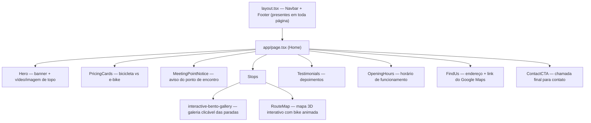

# 🚲 Sightseeing Bike Tours — Dublin

Site institucional e de vendas para uma empresa de passeios guiados de bicicleta e e-bike em Dublin. Construído com **Next.js (App Router)**, **React 19**, **TypeScript** e **Tailwind CSS v4**.

   

[](https://city-sightseeing-bike-tours.vercel.app)

---

## 📖 Sobre o projeto

Todo o conteúdo do site fica em **inglês** (público-alvo turista/estrangeiro), enquanto a documentação abaixo está em português para facilitar a manutenção. O site apresenta o passeio, a rota, os preços, e permite que o visitante entre em contato ou gerencie uma reserva — hoje via formulários simples (veja [Pontas soltas](#-pontas-soltas--próximos-passos)).

**A equipe de marketing publica promoções sozinha.** Preço promocional, popup de campanha, logo e as fotos e textos das 8 paradas do tour são editados por um painel próprio em `/admin` — sem precisar de desenvolvedor, sem deploy, sem mexer em código. Detalhes em [Painel de administração](#-painel-de-administração).

## 🧩 Como o projeto funciona

O app usa o **App Router** do Next.js: cada pasta dentro de `src/app/` vira uma rota, e o arquivo `page.tsx` dentro dela é o conteúdo daquela página. Todo o site é envolvido pelo mesmo layout (`src/app/layout.tsx`), que fixa o `Navbar` no topo e o `Footer` embaixo em **todas** as páginas.

A página inicial (Home) é montada empilhando componentes de seção, cada um vivendo em `src/components/`:



As demais páginas (`/the-tour`, `/private-hire`, `/contact`, `/booking`) são independentes, mas reaproveitam dois componentes de efeito visual:

- **`Reveal.tsx`** — envolve um bloco de conteúdo e o anima (fade + slide para cima) quando ele entra na tela ao rolar a página.
- **`ScrollLine.tsx`** — desenha uma linha tracejada em SVG que se "revela" conforme o scroll, com um ícone de bike 🚲 percorrendo o traçado.

## 🗺️ Onde encontrar cada coisa

Guia rápido de "quero mudar X, vou em Y":

| Quero mudar... | Vou em... |
|---|---|
| Texto/imagem do topo (Hero) | [`src/components/Hero.tsx`](src/components/Hero.tsx) |
| Preços das bikes (tradicional/e-bike) | [`src/components/PricingCards.tsx`](src/components/PricingCards.tsx) |
| Paradas do passeio (fotos, textos) | **`/admin/content`** — vêm do banco, não do código |
| Tamanho de cada parada no mosaico | [`src/components/Stops.tsx`](src/components/Stops.tsx) (`SPAN_BY_ID`) |
| Mapa 3D da rota / animação da bike no mapa | [`src/components/RouteMap.tsx`](src/components/RouteMap.tsx) |
| Depoimentos de clientes | [`src/components/Testimonials.tsx`](src/components/Testimonials.tsx) |
| Horário de funcionamento | [`src/components/OpeningHours.tsx`](src/components/OpeningHours.tsx) |
| Endereço / link do Google Maps | [`src/components/FindUs.tsx`](src/components/FindUs.tsx) |
| Menu de navegação (topo) | [`src/components/Navbar.tsx`](src/components/Navbar.tsx) |
| Rodapé, redes sociais, logos de parceiros | [`src/components/Footer.tsx`](src/components/Footer.tsx) |
| Cores da marca (vermelho, dourado, escuro) | [`src/app/globals.css`](src/app/globals.css) (bloco `@theme`) |
| Animação de "zoom lento" do Hero no mobile | [`src/app/globals.css`](src/app/globals.css) (`--animate-hero-zoom`) |
| Fotos das paradas do tour | [`public/stops/`](public/stops) |
| Fotos/vídeo do grupo e do guia | [`public/tour/`](public/tour) |
| Vídeo de fundo do Hero (desktop) | [`public/videos/hero-loop.mp4`](public/videos) |
| Ícones customizados (capacete, fone, etc.) | [`public/icons/`](public/icons) |
| Logos dos parceiros no rodapé | [`public/partners/`](public/partners) |

> ⚠️ **Desconto, popup de campanha, logo e as fotos/textos das paradas não se mexem por
> aqui.** Esse conteúdo vive no banco e é editado em `/admin` — alterar no código não
> muda o que aparece no site.

## 🔐 Painel de administração

O motivo de existir: uma campanha de desconto não pode depender da agenda de um
desenvolvedor. O time de marketing entra em `/admin`, muda, salva, e o site reflete na hora.

### O que dá pra editar sem código

| Tela | O que controla |
|---|---|
| **`/admin/marketing`** — Promotions & Popup | Percentual de desconto aplicado aos preços do site, e o popup de anúncio: título, mensagem, imagem, texto e link do botão, ligar/desligar |
| **`/admin/content`** — Branding & Points of Interest | Logo do site, e o texto curto, texto longo e foto de cada uma das 8 paradas do tour |

Imagens podem ser enviadas por upload direto ou por URL. O upload valida tipo
(`jpeg`, `png`, `webp`, `gif`) e tamanho (máx. 1 MB) antes de aceitar o arquivo.

### Como o acesso é protegido

- Login por senha (`ADMIN_PASSWORD`), comparada com `timingSafeEqual` para não vazar
  informação pelo tempo de resposta
- Sessão em cookie **`httpOnly`**, assinado com HMAC-SHA256 (`ADMIN_SESSION_SECRET`),
  válido por 14 dias e limitado ao path `/admin`
- Toda página do painel chama `requireAdminSession()` no servidor antes de renderizar —
  a proteção não depende do cliente
- `robots: { index: false }` no `/admin`, para não aparecer em busca

### Onde os dados ficam

Supabase, acessado via **REST direto com `fetch`** — sem SDK, o que mantém o bundle do
site enxuto. A leitura pública usa a chave `anon`; escrita e upload usam a
`service_role`, que só existe no servidor. Veja [`src/lib/popup.ts`](src/lib/popup.ts),
[`src/lib/promotion.ts`](src/lib/promotion.ts) e [`src/lib/storage.ts`](src/lib/storage.ts).

---

## 🧭 Páginas do site

| Rota | Arquivo | Conteúdo |
|---|---|---|
| `/` | [`src/app/page.tsx`](src/app/page.tsx) | Home — todas as seções principais |
| `/the-tour` | [`src/app/the-tour/page.tsx`](src/app/the-tour/page.tsx) | Detalhes do passeio guiado |
| `/points-of-interest` | [`src/app/points-of-interest/page.tsx`](src/app/points-of-interest/page.tsx) | Galeria + mapa das paradas (reaproveita `Stops`) |
| `/private-hire` | [`src/app/private-hire/page.tsx`](src/app/private-hire/page.tsx) | Passeio privado sob medida |
| `/contact` | [`src/app/contact/page.tsx`](src/app/contact/page.tsx) | Formulário de contato |
| `/booking` | [`src/app/booking/page.tsx`](src/app/booking/page.tsx) | Gerenciar reserva (reagendar/cancelar) |
| `/privacy-policy` | [`src/app/privacy-policy/page.tsx`](src/app/privacy-policy/page.tsx) | Política de privacidade |
| `/terms-and-conditions` | [`src/app/terms-and-conditions/page.tsx`](src/app/terms-and-conditions/page.tsx) | Termos e condições |

## ⚙️ Como rodar localmente

```bash
npm install     # instala as dependências
npm run dev     # inicia em http://localhost:3000
npm run build   # build de produção
npm run start   # roda o build de produção
npm run lint    # checagem de lint (ESLint)
```

## 🛠️ Stack técnica

- **Next.js 16** (App Router, Webpack)
- **React 19** + **TypeScript 5**
- **Tailwind CSS v4** — configuração via `@theme` direto no [`globals.css`](src/app/globals.css) (sem `tailwind.config.js`)
- **MapLibre GL** — carregado via CDN dentro de `RouteMap.tsx` (não é dependência do `package.json`) para o mapa 3D interativo
- **Supabase** — conteúdo editável pelo painel e armazenamento de imagens, acessado por REST com `fetch` (sem SDK, para não pesar o bundle)
- **Server Actions** do Next para o login e as gravações do `/admin`, com sessão em cookie assinado por HMAC

## 🚧 Pontas soltas / próximos passos

Coisas que ainda não estão de fato "ligadas" e valem atenção antes de considerar o site pronto para produção:

- Os formulários de **Contact** e **Manage Booking** ainda não enviam para lugar nenhum (sem `action`/backend/serviço de e-mail conectado).
- `FindUs.tsx` ainda tem o endereço e o link do Google Maps como placeholder (`[Full meeting point address — replace with the real address]`).
- Vídeo de fundo do Hero só toca em telas ≥768px (desktop); no mobile é substituído por imagem estática com zoom lento, por performance.

## ☁️ Deploy

Projeto pronto para deploy na [Vercel](https://vercel.com/new) (padrão para apps Next.js) — basta importar o repositório, sem configuração adicional.
